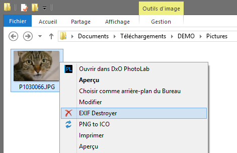

# EXIF Destroyer

## About
[KISS](https://en.wikipedia.org/wiki/KISS_principle) batch script to easily remove EXIF data from JPG files using [ExifTool](http://owl.phy.queensu.ca/~phil/exiftool/).  
Don't want to deal with Command Line or install a heavy, bloated program ? Well, you're in the right place !

## Usage

On Microsoft Windows, from File Explorer, right clic an image file or a folder containing image files, and select `EXIF Destroyer`.  
If you don't want to use the provided installer (`exif_destroyer_setup.exe`), drag & drop a folder or an image to `exif_destroyer.bat`.  

By default, all EXIF metadata are removed, except camera orientation (can't pose a privacy / security problem).  
Cleaned JPG are generated in same folder as original files, with "_noexif" suffix in filename.  
Stable version of [ExifTool](http://owl.phy.queensu.ca/~phil/exiftool/) is built-in.

## Requirements
- Microsoft Windows

## License
EXIF Destroyer is released under the [Unlicense](http://unlicense.org).